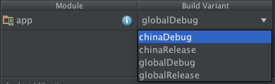

# Flitto Android Multi-Project Build Sample
This sample project consists of the two build types (debug and release) and two product flvaors as deploy type (global and china) to build multi-projects by using build variants.

## Why?
The goal is 'Only Import The Resources We Need'. There are two subprojects to support Global(googleplay, naver, etc) and China(360, wandoujia, etc) in Flitto's app. But the app keeps getting bigger and bigger and has lots of dependencies with third-party libraries. As a result, the android library's dex has grown into the dreaded [Building Apps with Over 65K Methods](http://developer.android.com/intl/ko/tools/building/multidex.html) issue. Unfortunately we have to use multidex. so we used [Build variants](http://developer.android.com/intl/ko/tools/building/configuring-gradle.html) to make it works seperate builds which are global and china build. 

### Multi-Project Builds
Our project build in gradle consists of one root project, and two subprojects. Define two product flavors for the app module as the below configuration. Finally we can change build variant that we want on Android Studio as the below screenshot.

##### Build Variant 



##### build.gradle

```shell
...
    buildTypes {
        release {
            minifyEnabled false
            proguardFiles getDefaultProguardFile('proguard-android.txt'), 'proguard-rules.pro'
        }
        debug {
            debuggable true
        }
    }

    productFlavors {
        global {
            versionCode 1
            versionName "1.0-global"
        }
        china {
            versionCode 1
            versionName "1.0-china"
        }
    }
}
...
```

### Multiple External Library
* Import Remote Library
* Import Library Folder

1. You can import the libraries you need to each subproject as you can guess, use <label for productFlavor>compile'.

2. Check library's xml list which you add multiple lines of dependencies for each product flavor in libraries folder (path : /project/.idea/)

3. Change other Build Variant and Sync gradle.

4. Check library's xml list again to see what are changed.

##### build.gradle

```shell
...
dependencies {
    ...

    chinaCompile 'com.mcxiaoke.volley:library:1.0.19'
    chinaCompile fileTree(dir: 'src/china/library-china', include: ['*.jar'])

    globalCompile 'com.nostra13.universalimageloader:universal-image-loader:1.9.3'
    globalCompile fileTree(dir: 'src/global/library-global', include: ['*.jar'])

    ...
}
...
```

### Two Flavors with Different AndroidManifest files
Permission is getting more and more important from Android 6.0. So we made AndroidManifest file to each flavor subproject.

> ##### Adding AndroidManifest file
* /src/global/AndroidManifest.xml
* /src/china/AndroidManifest.xml

### Directory Structure
```shell
+   app
|   +– src
|   |   +– china
|   |   |   +– java
|   |   |   +– res  
|   |   |   \– AndroidManifest.xml
|   |   +– global
|   |   |   +– java
|   |   |   +– res  
|   |   |   \– AndroidManifest.xml
|   |   +– main
|   |   |   +– java
|   |   |   +– res  
|   |   |   \– AndroidManifest.xml
|   +– build.gradle
/
```

### Next Step
* We are supporting more than 30 China stores, so how do we make multiple apk files that are a little different each other at once?
* Two Flavors with different build.gralde files.

### Ref
* [Build System Overview](http://developer.android.com/intl/ko/sdk/installing/studio-build.html)
* [Configuring Gradle Builds](http://developer.android.com/intl/ko/tools/building/configuring-gradle.html)
* [Build System Concepts](http://tools.android.com/tech-docs/new-build-system/build-system-concepts)
* [Multi-project Builds](https://docs.gradle.org/current/userguide/multi_project_builds.html)

Written by KimKevin(kevin@flitto.com) at Flitto
